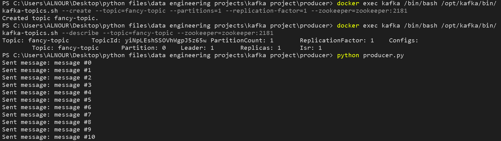
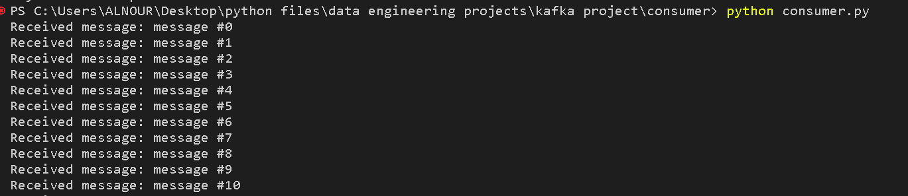

# kafka-producer-consumer-in-python
This is a simple example of using Kafka with Python and Docker Compose. The project contains a Kafka producer that sends messages to a Kafka topic, and a Kafka consumer that receives messages from the same topic.

## Prerequisites
-Docker
-Docker Compose
-Python 3.x
-kafka package installed (pip install kafka-python)

## Usage
To run the project, follow these steps:

Clone this repository: ' git clone https://github.com/mohamedehabpop/kafka-producer-consumer-in-python.git '
Navigate to the project directory: '''bash cd kafka-producer-consumer-in-python '''
Start the Kafka cluster and ZooKeeper with Docker Compose: '''bash docker-compose up '''
initiate kafka topic with a partition for every consumer and 1 replica for every broker befotre running the producer
'''bash cd producer'''
'''docker exec kafka /bin/bash /opt/kafka/bin/kafka-topics.sh --create --topic=fancy-topic --partitions=1 --replication-factor=1 --zookeeper=zookeeper:2181 '''

Run the Kafka producer: '''bash python producer.py '''
Run the Kafka consumer: '''bash python consumer.py '''

The producer will send messages to the Kafka topic every second. The consumer will receive these messages and print them to the console.

To stop the project, use Ctrl+C to stop the consumer and producer, and run docker-compose down to stop the Kafka cluster.

## Final result

